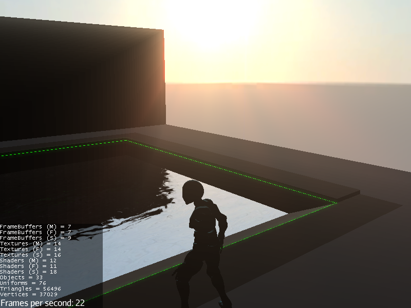
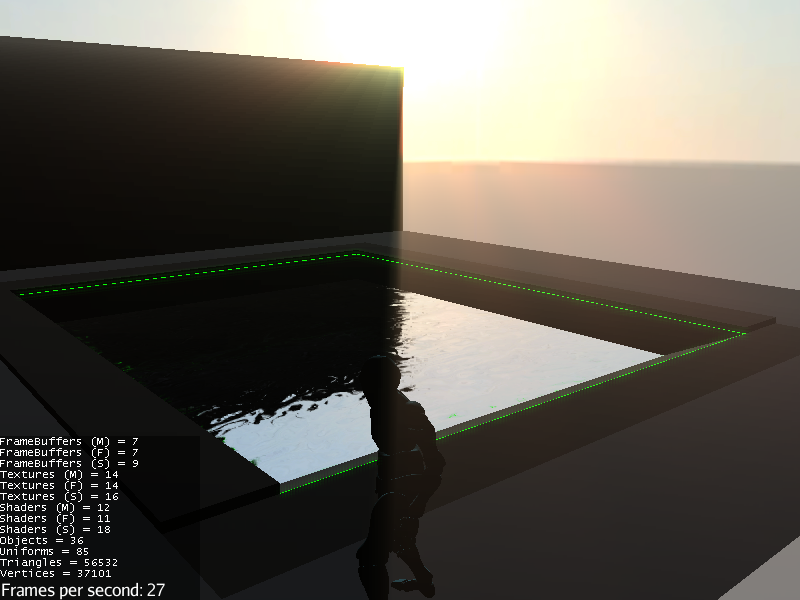
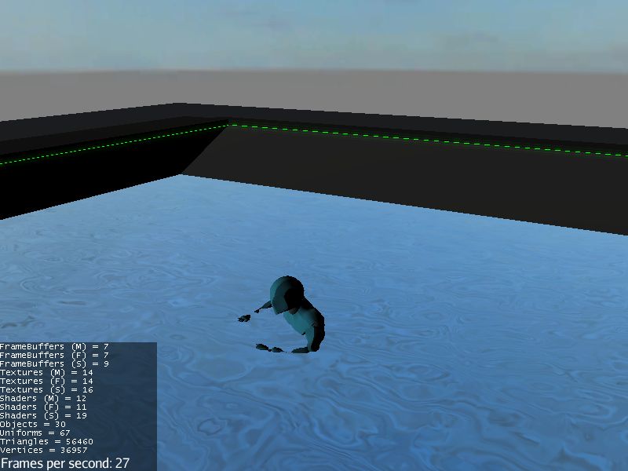
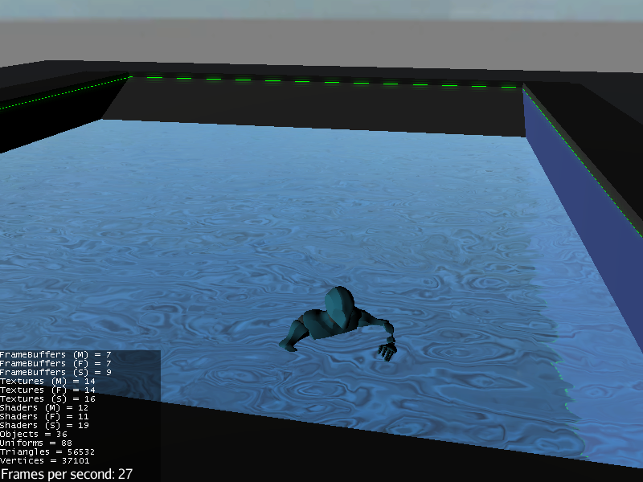
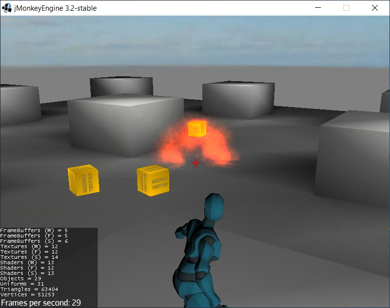
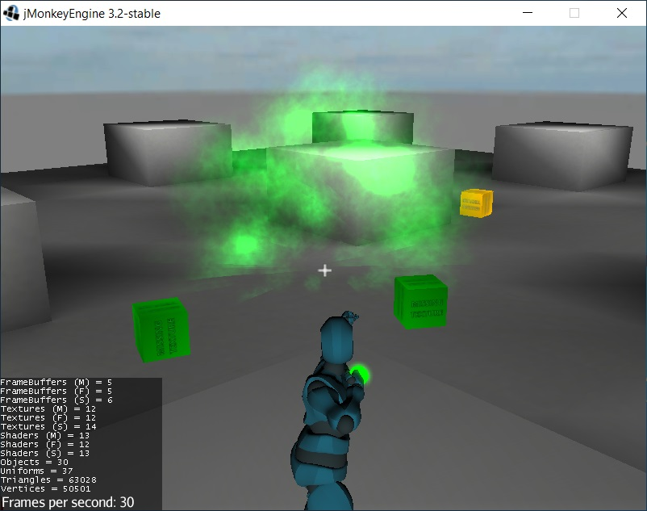
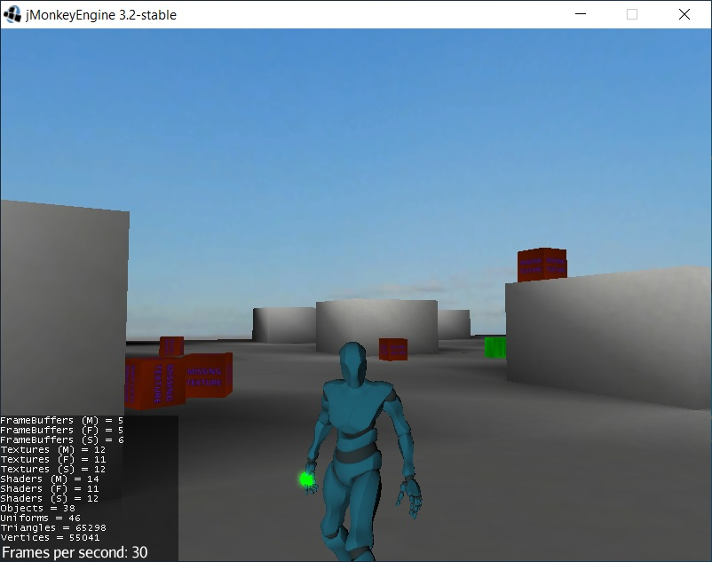

# Archer-Game-Template
A Third Person Shooter demo made with jMonkeyEngine. Build with gradle.

The demo contains:

* Physics (with bullet engine)
* Physics raycast to detect hit collision
* Animations (with gltf2 animations, file .blend included): 
    * "Idle", "Running", "Running_2", "Aim_Idle", "Aim_Overdraw", "Aim_Recoil", "Draw_Arrow", "Water_Idle", "Water_Moving", "Swimming"
* Third Person Camera with collision detection
* Bow with two types of ammo and effect
* Dynamic update of camera FOV when aiming
* Keyboard/Mouse and Joystick support
* Sounds
* Particles
* Postprocessing
* ... many many useful functions! Stay tuned for the next addon.

# New add-on: Swimming System
* add Trigger System based on Unity Collider

Resource Used:

- Code
    - [jMonkeyEngine](https://jmonkeyengine.org/)
    
- Assets
    - [Mixamo](https://www.mixamo.com/)
    - [Blender](https://www.blender.org/download/)

# Swimmming System

------

------

------

# Archer

------

------

